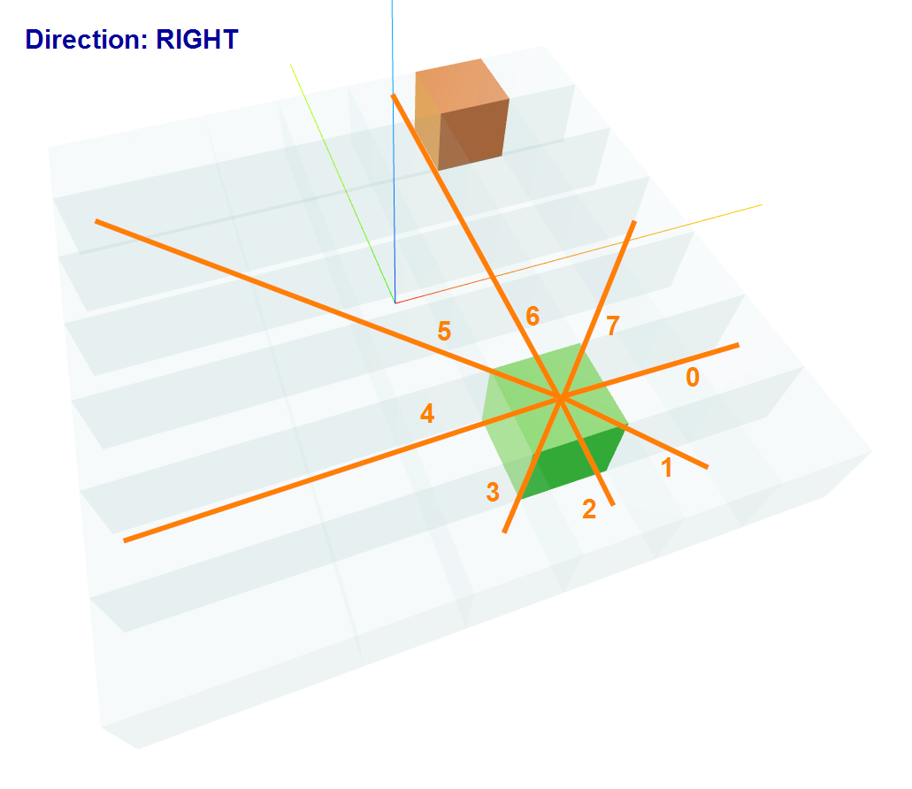
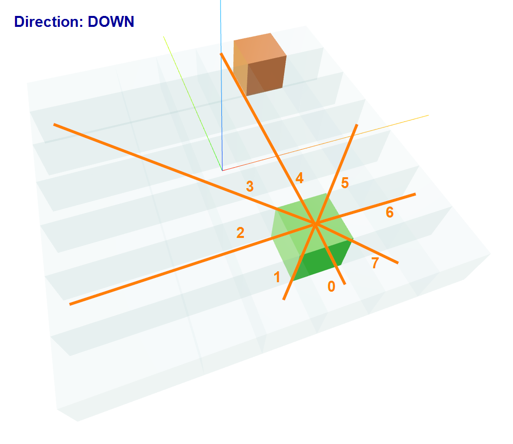
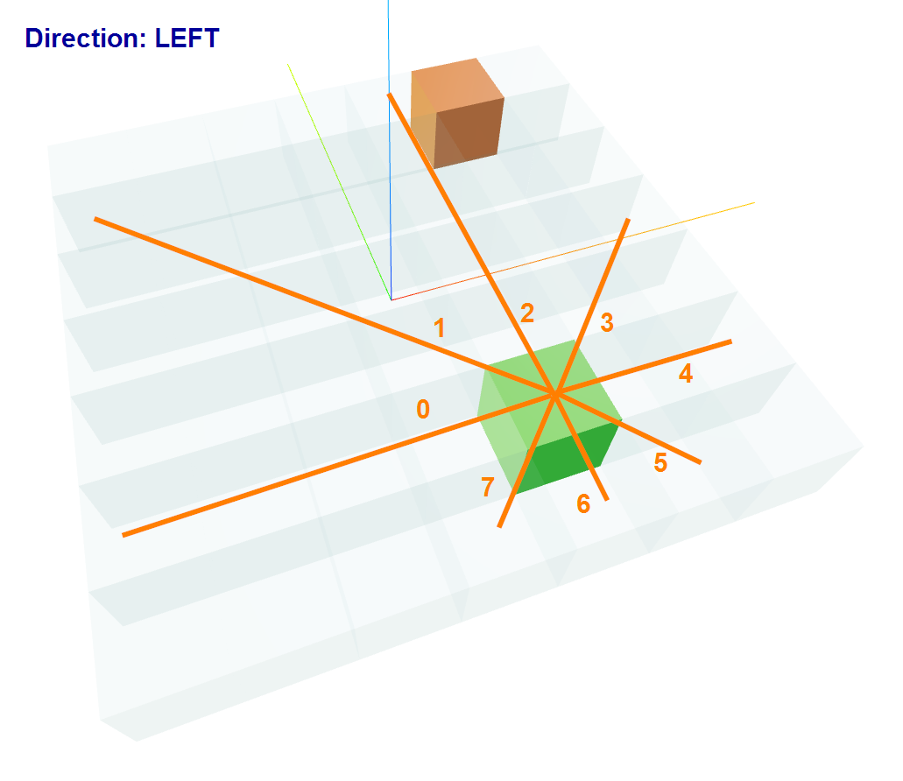

# Snake Environment
## How to run?

## Enums:
### Action
* `LEFT (-1)`
* `STRAIGHT (0)`
* `RIGHT (1)`

### Direction
* `UP (0)`
* `RIGHT (1)`
* `DOWN (2)`
* `LEFT (3)`

### Field
* `WALL (0)`
* `SNAKE_BODY (1)`
* `SNAKE_HEAD (2)`
* `EMPTY (3)`
* `APPLE (4)`

### RaycastingDirections
* `NORTH (x=0, y=1)`
* `NORTH_EAST (x=1, y=1)`
* `EAST (x=1, y=0)`
* `SOUTH_EAST (x=1, y=-1)`
* `SOUTH (x=0, y=-1)`
* `SOUTH_WEST (x=-1, y=-1)`
* `WEST (x=-1, y=0)`
* `NORTH_WEST (x=-1, y=1)`

## Block 
Easy to understand. Describe snake body, food and obstacles.

## Snake
### Parameters
#### Constants
They depend on the parameters passed to the constructor.
* `is_penetration_active` - if True snake can go through the wall and appear on the other side of the map (**to develop**)
* `size_x` - size of the board
* `size_y` - size of the board
#### Variables
* `_direction` - direction of the snake `(UP, RIGHT, DOWN, LEFT)`
* `_body` - list of blocks
* `previous_tail_brick` - block that was removed from the tail of the snake
* `alive` - if False snake is dead
* `previous_direction` - direction of the snake before the last move

### restet
Reset snake to initial state.
* `_direction` - Direction.RIGTH
* `_body` - [ ]
* `previous_tail_brick` - None
* `alive` - True
* `previous_direction` - None

### get_random_head
Return random head position.

### append_food
Append food to the snake body based on `previous_tail_brick` position.

### insert_body
Add block to `body` list in position 0.

### modify_snake + move
From action (-1 to 1) we can define new direction of snake.
If direction is down (2) and action is left (-1) then new direction is:

`current direction` + `action` = `2 + (-1) = 1 % 4 (number of possible direction` => `new direction is RIGHT (1)`

If direction is left and action is right then new direction is:

`current direction` + `action` = `3 + 1 = 4 % 4 = 0` => `new direction is UP (0)`

With a new direction we can define new head position:
* insert new hear to position 0 of the `body` array
* remove last element of the `body` array
* assign removed brick to `previous_tail_brick` variable
* check if new move is valid (if not set `alive=False`)
* if food in found we can `previous_tail_brick` and `append_food` it to the body array

### is_new_head_valid
Check if new head position is valid

#### is_self_clash
Check if new snake head is not on the snake body

#### is_move_in_boundries
Check if new snake head is not outside the board

### get_direction_from_action
Return new direction based on action.

### get_direction_vector
Return direction vector as np.array
is direction is 
* `UP:[1, 0, 0, 0]`
* `RIGHT:[0, 1, 0, 0]`
* `DOWN:[0, 0, 1, 0]`
* `LEFT:[0, 0, 0, 1]`

### project_snake_on_board
Return board with snake body and head as np.array

## Vision
Provides vision inside environment. It's based on raycasting depending upon a snake direction.
The raycasting is always in the reference to the snake direction As shown below:
### UP

### RIGHT

### DOWN

### LEFT

### _rotate_from_direction
#### Global coordinate system
`NORTH => NORTH_EAST => EAST => SOUTH_EAST => SOUTH => SOUTH_WEST => WEST => NORTH_WEST`
#### Local coordinate system
Direction:
* UP

`NORTH => NORTH_EAST => EAST => SOUTH_EAST => SOUTH => SOUTH_WEST => WEST => NORTH_WEST`
* RIGHT

`EAST => SOUTH_EAST => SOUTH => SOUTH_WEST => WEST => NORTH_WEST => NORTH => NORTH_EAST`
* DOWN

`SOUTH => SOUTH_WEST => WEST => NORTH_WEST => NORTH => NORTH_EAST => EAST => SOUTH_EAST`
* LEFT

`WEST => NORTH_WEST => NORTH => NORTH_EAST => EAST => SOUTH_EAST => SOUTH => SOUTH_WEST`

### _detect_obstacle_in_direction
**To describe and refactor**

### look
Return two tuples of eight elements:
* distances (0-1)
* targets (Field enum)

### get_food_direction_vector
Return vector of 10 elements:

first 6 elements are binary indicators (0 or 1) of direction to food:
* `x+` (1 if food is on the right side of the snake head)
* `x0` (1 if food is on the same x axis as snake head)
* `x-` (1 if food is on the left side of the snake head)
* `y+` (1 if food is on the top side of the snake head)
* `y0` (1 if food is on the same y axis as snake head)
* `y-` (1 if food is on the bottom side of the snake head)

Next four describe the distance(0 to 1) to food in each direction:

**WHEN snake.is_penetration_active == FALSE**

* `x+` (distance to food on the right side of the snake head)
* `x-` (distance to food on the left side of the snake head)
* `y+` (distance to food on the top side of the snake head)
* `y-` (distance to food on the bottom side of the snake head)

if brick is located ie. x = 0.4 and y = -0.8, then indicators look as follow:

**WHEN snake.is_penetration_active == FALSE**

`[1, 0, 0, 0, 0, 1]` (binary indicators)

PLUS

`[0.4, 0, 0, 0.8]` (distance indicators)

**WHEN snake.is_penetration_active == TRUE**

`[1, 0, 0, 0, 0, 1]` (binary indicators)

PLUS

`[0.4, 0.6, 0.2, 0.8]` (distance indicators)

### _get_food_distance
Return direction to food as normalized np.array in the reference to the snake direction.

## Environment

### Parameters
#### Publishing
* `PUBLISHER_ADDRESS = 'http://127.0.0.1:5001'`
#### Constants
They depend on the parameters passed to the constructor.
* `device` - cpu or cuda
* `is_penetration_active` - if True snake can go through the wall and appear on the other side of the map (**to develop**)
* `size_x` - size of the board
* `size_y` - size of the board
* `update_environment` - if True environment is published to flask server
#### Variables
* `number_of_steps = 0`
* `number_of_steps_without_food = 0`
* `number_of_turns_without_food = 0`
* `score = 0`
* `reward = 0`

#### Rewards:
* `CLASH_REWARD = -2.5`
* `FOOD_REWARD = 1`
* `STEP_REWARD = -0.025`

### reset
Reset environment to initial state and generate food + snake status.

### generate_food
Generate food in random position.

### __get_board_with_snake_items_only
Return board with snake items only.

### get_board
Return board with all items as np.array

### check_food
Check if snake head is on the food position.

### observe
Return observation of the environment as np.array
* `distance`
* `targets`
* `food_direction`
* `snake_direction_vector`

### move_snake(action)
Move snake in the direction of action + controls environment variables depending on the action.

It returns torch tensors of:

* `reward`
* `is_snake_alive`
* `score`

# Agent
**TO Document**